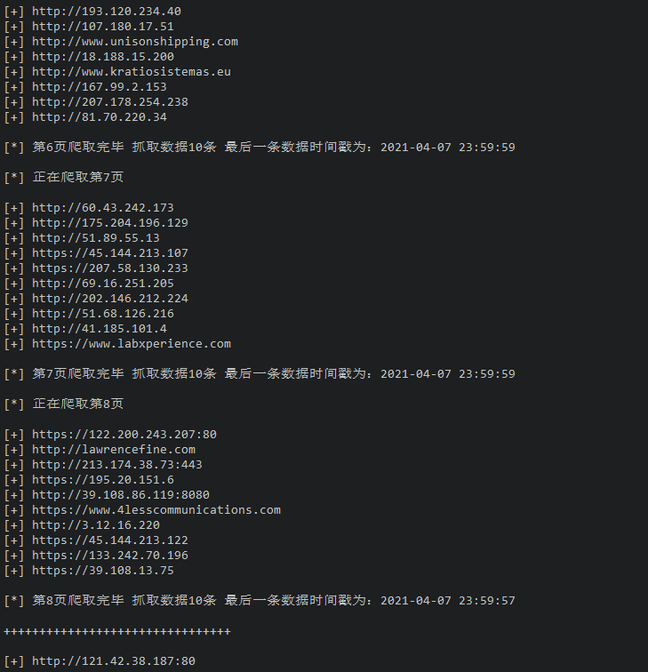
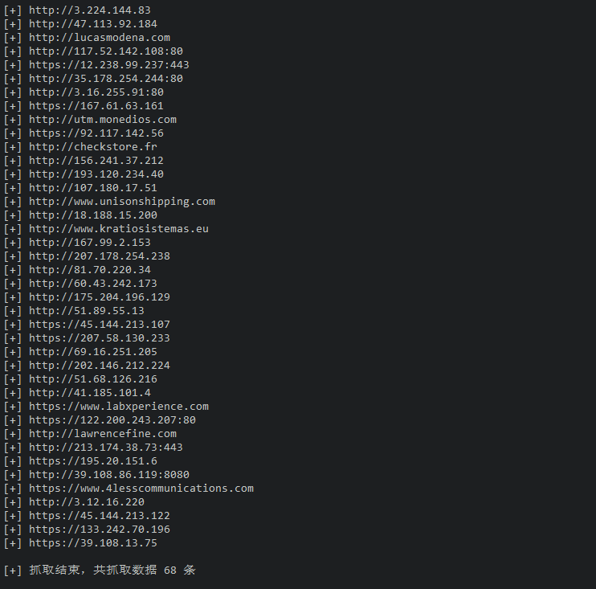

####fofa再反爬，
好像已经失效，有空了再重写

################################################################

# fofa_spider-1.0.3
非付费会员，fofa数据无限抓取版

### 终于升级到无限抓取版了。

### 理论上可以无限抓取fofa数据。

但仅仅是理论上，因为fofa设置了普通会员只能查看5页数据。这时，当你查询的关键词数据量比较大的时候，5页定然不能显示出当天数据的全部。
而本spider采取的抓取凭据为时间，fofa的时间关键词只能使用到日期，日期以下的小时甚至分钟不能使用为关键词。

所以，这时候就出现了当天数据抓取不完，直接跳到前一天抓取数据的情况。

### 但是

如果你的关键词够细，当天数据量较少，那么数据就可以一网打尽了。
spider会自动抓取最后一条数据的时间戳，并且将此时间的前一天加为新一轮抓取的关键词，继续抓取数据。

### 自动去重功能。

因为连续抓取会以时间为keywords，多次、连续设置关键词，而且为了尽量少遗漏数据，最后一轮的时间戳为减一天再加入下一轮关键词。所以数据是会重复。碰上数据较多的时候，重复量还是很大的，所以输出数据加入去重功能。

当然，这也是为什么你会看到抓取时打出来的数据和最后保存的数据总量不一样的原因。

使用方法和前一个版本一样，没变

1.将cookie中的fofa_token复制到config.py中对应的位置

2.python3 fofa_spider.py

demo

### 如果你觉得好用，请给作者买杯咖啡

